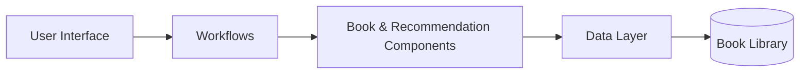
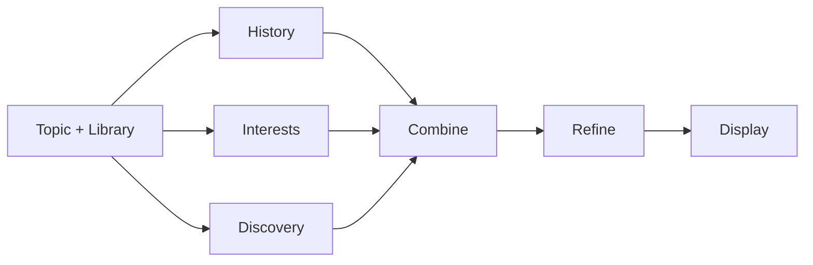

# The Reading Room | Personal Book Manager

A personal terminal application for MIT 1.125 Problem Set 2. Manage a reading library, enrich book information, and discover books through three parallel Codex recommendation strategies.

## Setup and run

These instructions are for macOS with [Homebrew](https://brew.sh/) installed.

### 1. Install dependencies

```bash
brew install git gum python
brew install --cask codex
```

The application uses Bash, Gum, Python 3, and the Codex CLI. It does not require jq or additional Python packages. See the [official Codex CLI documentation](https://developers.openai.com/codex/cli/) for other installation options.

### 2. Download this project

```bash
git clone https://github.com/diaomj668/1.125ps02.git
cd 1.125ps02
```

If you already downloaded the project, open a terminal in the directory containing `app.sh` instead.

### 3. Sign in to Codex

```bash
codex login
codex login status
```

Choose **Sign in with ChatGPT** and use your own account with Codex access. Internet access and available account usage are required for metadata and recommendations.

### 4. Start the application

```bash
./app.sh
```

Use the arrow keys to navigate, Enter to select, and **Quit** to exit. Press Enter at the return prompt to go back to the main menu.

## What you can do

| Menu action | Behavior |
| --- | --- |
| Browse Library | Display saved books, reading statuses, and ratings |
| Add Book | Enter a title and author, request metadata, edit the genre, and save |
| Search Library | Search saved records by keyword |
| Update Status / Rating | Change a saved book's reading status or rating |
| Get Recommendations | Enter a topic, wait for three strategies, and optionally save a result |

Statuses are `owned`, `want-to-read`, `reading`, and `finished`. Ratings are 1-5; 0 means unrated. Saved recommendations start as `want-to-read`.

Try a topic such as `sustainable architecture`, `urban housing`, or `AI and design`. Recommendations use your current input, not a preset list of topics or books.

## Architecture

The application follows **UI -> Workflows -> Book / Recommendation Components -> Data Layer -> Storage**. `app.sh` checks dependencies and opens the main menu. The `ui/` scripts handle interaction, while `workflows/` coordinate operations. The `books/` scripts enrich and search books; the `recommendations/` scripts generate and refine candidates. Only `data/book_database.sh` directly reads or writes `data/books.csv`. Bash handles process coordination, pipes, and temporary files. Small Python blocks parse JSON, and Python's standard CSV library preserves commas and quotes in stored records.



### Recommendation flow



The three strategies run in parallel. Their results are combined, filtered, and ranked before display.

## Personalization

My interests include architecture, cities, technology, AI, and design. I chose to enter a topic for each recommendation request so the application can follow what I am exploring at the moment. The history strategy connects suggestions to my saved books and ratings, while discovery adds unexpected perspectives. I prioritize books supported by multiple strategies and show their reasons so I can decide what to read. The English interface uses a compact reading-room theme with teal accents.

## Demo

The narrated demonstration video has not been added yet.

## Credits

Based on the [course starter repository](https://github.com/onexi/ps02). The original MIT license is preserved in `LICENSE`.
